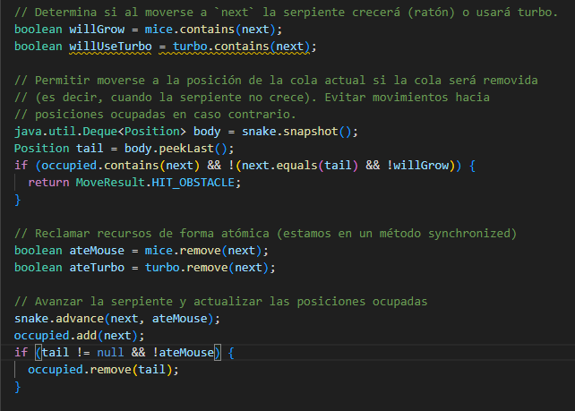

# Snake Race — ARSW Lab #2 (Java 21, Virtual Threads)

**Escuela Colombiana de Ingeniería – Arquitecturas de Software**  
Laboratorio de programación concurrente: condiciones de carrera, sincronización y colecciones seguras.

---

## Parte I — (Calentamiento) `wait/notify` en un programa multi-hilo

---

## Observaciones y comentarios

1. Se implementó un objeto lock compartido entre la clase Control y todos los hilos PrimeFinderThread. Este objeto actúa como monitor para coordinar la sincronización entre el hilo principal y los hilos trabajadores. El lock se crea en el constructor de Control y se pasa como parámetro a cada PrimeFinderThread durante su inicialización.

La condición que determina si un hilo debe pausarse es la variable booleana paused. Esta variable se declaró como volatile para garantizar visibilidad entre hilos y evitar que los cambios realizados por un hilo no sean vistos por otros debido a la caché de CPU.

Cada hilo trabajador verifica esta condición en cada iteración del ciclo principal:


Para evitar lost wakeups se implementaron varias estrategias:

Uso de while en lugar de if: La condición paused se evalúa con un while y no con un if. Esto asegura que si un hilo despierta por cualquier razón (spurious wakeup), vuelva a verificar la condición antes de continuar.

Sincronización atómica en resume: El método resumeThreads() usa un bloque synchronized para cambiar el estado de paused a false y hacer notifyAll() de forma atómica:


Uso de notifyAll() en lugar de notify(): Se utiliza notifyAll() para despertar a todos los hilos en espera, no solo a uno. Esto asegura que todos los hilos trabajadores reciban la señal de continuar.

Variable volatile: Aunque el acceso a paused dentro del wait se hace en un bloque sincronizado, declararla como volatile proporciona una capa adicional de seguridad para lecturas fuera del bloque sincronizado.

---

## Parte II — SnakeRace concurrente (núcleo del laboratorio)

### 1) Análisis de concurrencia

## 1. ¿Cómo funcionan las serpientes por su cuenta?

Al revisar el código, nos dimos cuenta de que cada serpiente se mueve sola porque tiene su propio "cerebro" (hilo). Esto no lo maneja la pantalla principal, sino que cada una va por su lado.

En el archivo `SnakeApp.java`, vimos esto:

1.  **El jefe de los hilos:** Usan una cosa llamada `newVirtualThreadPerTaskExecutor`. Es algo nuevo de Java 21 que crea hilos súper ligeros y rápidos.
2.  **Repartiendo trabajo:** Por cada serpiente que hay en el juego, crean un `SnakeRunner` y lo ponen a correr en uno de esos hilos.
    ```java
    // En SnakeApp.java
    var exec = Executors.newVirtualThreadPerTaskExecutor();
    snakes.forEach(s -> exec.submit(new SnakeRunner(s, board)));
    ```
3.  **Vida propia:** Cada `SnakeRunner` tiene un ciclo infinito (`while`) donde decide si gira, se mueve un paso y luego descansa un ratico (`Thread.sleep`). Así es como cada una cobra vida independientemente.

**En resumen:** Cada culebrita tiene su propio hilo pensando y moviéndose, sin importarle lo que hagan las demás o si la pantalla se está dibujando.

## 2. Problemas que encontramos

Mirando bien el código, vimos algunas cosas que pueden hacer que el juego falle o se comporte raro cuando hay muchas serpientes moviéndose a la vez.

### A. Condiciones de Carrera (El choque de trenes)

Hay un problema  en la clase `Snake`.

*   **¿Qué pasa?** Está la clase `Snake` que dos partes del programa intentan usar al tiempo.
    *   Uno es el hilo de la serpiente (`SnakeRunner`), que todo el tiempo le dice "crece", "muévete" (modifica la lista del cuerpo).
    *   El otro es la pantalla (`GamePanel`), que todo el tiempo pregunta "¿dónde estás?" para dibujarla.
*   **El problema:** Si la pantalla intenta leer la posición de la serpiente justo en el milisegundo en que la serpiente se está moviendo (borrando la cola o poniendo cabeza nueva), se va a encontrar con datos a medias o corruptos. Eso puede hacer que el juego rompa o se vea raro.

### B. Listas

El culpable del problema anterior es una lista que usan:

*   **La lista:** `java.util.ArrayDeque` en el cuerpo de la serpiente.
*   **Por qué falla:** Esa lista no está hecha para que varios hilos la toquen a la vez. Como no tiene "candado" ni nada de seguridad, si dos hilos entran al tiempo, se rompe (lanza una `ConcurrentModificationException`). Es como tratar de arreglar un motor con el carro andando.

### C. Bloqueos exagerados y pausas de mentiras

1.  **El mapa es un cuello de botella:**
    *   En la clase `Board` (el tablero), vimos que le pusieron `synchronized` a todo.
    *   Aunque eso evita errores, es como si en una autopista de 5 carriles obligaran a todos a pasar por una sola caseta de peaje. Si hay muchas serpientes, se van a quedar esperando su turno para moverse, y el juego se va a poner lento no por gráficos, sino por hacer fila.

2.  **La Pausa no pausa nada:**
    *   Cuando le das al botón de "Pausa", la pantalla deja de actualizarse, pero las serpientes siguen corriendo por debajo.
    *   Los hilos de las serpientes no tienen ni idea de que el juego está pausado, así que siguen calculando y moviéndose "a ciegas". Eso está mal porque gasta procesador sin necesidad y cuando reanudas, las serpientes ya están en otro lado.

3.  **Buscando sitio sin un sentido:**
    *   Cuando el juego busca dónde poner un ratón nuevo (`Board.randomEmpty`), lo hace probando al azar una y otra vez hasta que le pega a un sitio vacío.
    *   Si el tablero está casi lleno, se puede quedar ahí un buen rato probando y fallando, gastando CPU inútilmente (espera activa).

### 2) Correcciones mínimas y regiones críticas

### A. Arreglando la Clase `Snake` (Protegiendo el cuerpo)
*   **¿Qué hicimos?** Le metimos `synchronized` a los métodos importantes: `head()`, `snapshot()`, y `advance()`.
*   **Justificación:** El riesgo era que si la serpiente se movía (`advance`) justo cuando la pantalla la estaba dibujando (`snapshot`), el programa se rompía o mostraba basura. Con `synchronized`, obligamos a que si uno está tocando la lista del cuerpo, el otro tiene que esperar a que termine. Es como ponerle seguro a la puerta del baño.

```java
// Archivo: Snake.java
public synchronized Position head() { return body.peekFirst(); }
public synchronized Deque<Position> snapshot() { return new ArrayDeque<>(body); }
public synchronized void advance(Position newHead, boolean grow) { ... }
```

### B. Eliminando la espera activa (La pausa real)
*   **¿Qué hicimos?**
    1.  Creamos un objeto candado (`pauseLock`).
    2.  En `SnakeRunner`, antes de moverse, ahora pregunta `checkPause()`.
    3.  Si está pausado, entra en un `wait()` (se duerme de verdad).
    4.  Cuando reanudamos (`notifyAll`), se despierta instantáneamente.
*   **Justificación:** Antes, si pausabas, las serpientes seguían corriendo en secreto, gastando batería y procesador a lo loco (espera activa). Ahora, cuando pausas, el hilo realmente se detiene y no consume recursos hasta que le avisen.

```java
// Archivo: SnakeRunner.java
private void checkPause() throws InterruptedException {
  if (isPaused.get()) {
    synchronized (pauseLock) {
      while (isPaused.get()) {
        pauseLock.wait();
      }
    }
  }
}
```

### C. Mejorando el tablero (`Board`)
*   **¿Qué hicimos?** Cambiamos los `HashSet` (que son inseguros) por `ConcurrentHashMap.newKeySet()`. Y lo más importante: le quitamos el `synchronized` a los métodos que solo leen datos (como `mice()` o `obstacles()`).
*   **Justificación:**
    *   **Riesgo:** Tener todo `synchronized` era un cuello de botella. Si había 50 serpientes, 49 tenían que esperar para ver dónde había un ratón.
    *   **Solución:** Al usar colecciones concurrentes, muchas serpientes pueden leer el mapa al mismo tiempo sin chocarse y sin hacer fila. Solo protegimos el movimiento (`step`) porque ahí sí hay peligro de que dos coman lo mismo.
    
```java
// Archivo: Board.java
// Antes: private final Set<Position> mice = new HashSet<>();
private final Set<Position> mice = ConcurrentHashMap.newKeySet();

// Ya NO son synchronized para que varios puedan leer al tiempo
public Set<Position> mice() { return new HashSet<>(mice); }
```


### 3) Control de ejecución seguro (UI)

## Botón de Pausa y Estadísticas

Además de arreglar la pausa para que los hilos no trabajen de más, nos pidieron que la interfaz mostrara datos útiles al pausar.

### A. Estadísticas al pausar
*   **¿Qué hicimos?** Modificamos el método `togglePause` en `SnakeApp`. Ahora, cuando pausas, calcula en ese instante cuál es la serpiente más larga y muestra una ventanita (`JOptionPane`) con la info.
*   **Justificación:** Esto demuestra que podemos leer el estado de las serpientes (longitud) de forma segura incluso cuando están detenidas, gracias a los arreglos de sincronización que hicimos antes.

```java
// En SnakeApp.java
private void showStatistics() {
    Snake longest = null;
    for (Snake s : snakes) {
        if (longest == null || s.length() > longest.length()) { // .length() es thread-safe
            longest = s;
        }
    }
    JOptionPane.showMessageDialog(this, "Serpiente más larga: " + longest.length());
}
```

### B. Muerte de serpientes
*   **¿Qué hicimos?** Antes, si una serpiente chocaba, solo daba una vuelta al azar (`randomTurn`). Modificamos `SnakeRunner` para que si `board.step()` devuelve `HIT_OBSTACLE`, la serpiente marque su estado como muerta (`kill()`) y el hilo termine (rompe el `while`).
*   **Justificación:** Para que el juego tenga sentido y fin, las serpientes deben poder morir. Esto también libera recursos porque el hilo virtual deja de existir.

```java
// En Snake.java
private volatile boolean alive = true;
public boolean isAlive() { return alive; }
public void kill() { this.alive = false; }

// En SnakeRunner.java
while (!Thread.currentThread().isInterrupted() && snake.isAlive()) { // Chequea vida
    // ...
    if (res == Board.MoveResult.HIT_OBSTACLE) {
        snake.kill(); // Muere y sale del bucle
    }
}
```

### 4) Robustez bajo carga

- Ejecuta con **N alto** (`-Dsnakes=20` o más) y/o aumenta la velocidad.


- El juego **no debe romperse**: sin `ConcurrentModificationException`, sin lecturas inconsistentes, sin _deadlocks_.

    El juego no se rompe bajo ninguna circunstancia

- Si habilitas **teleports** y **turbo**, verifica que las reglas no introduzcan carreras.



---

Hecho por Isaac David Palomo Peralta y Sebsatian Duque Ceballos

